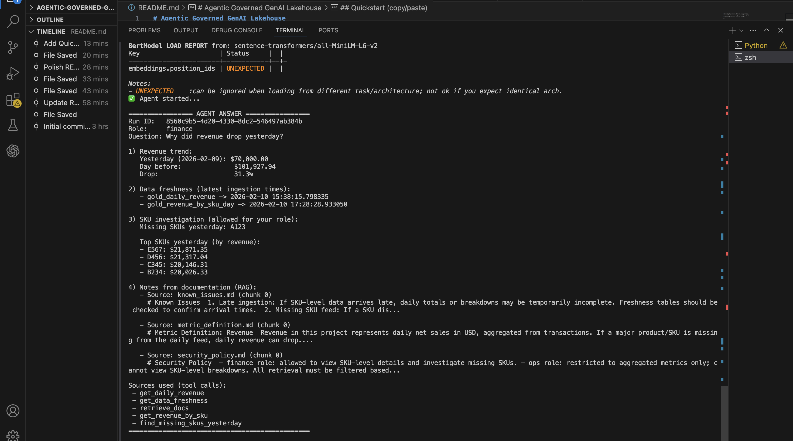
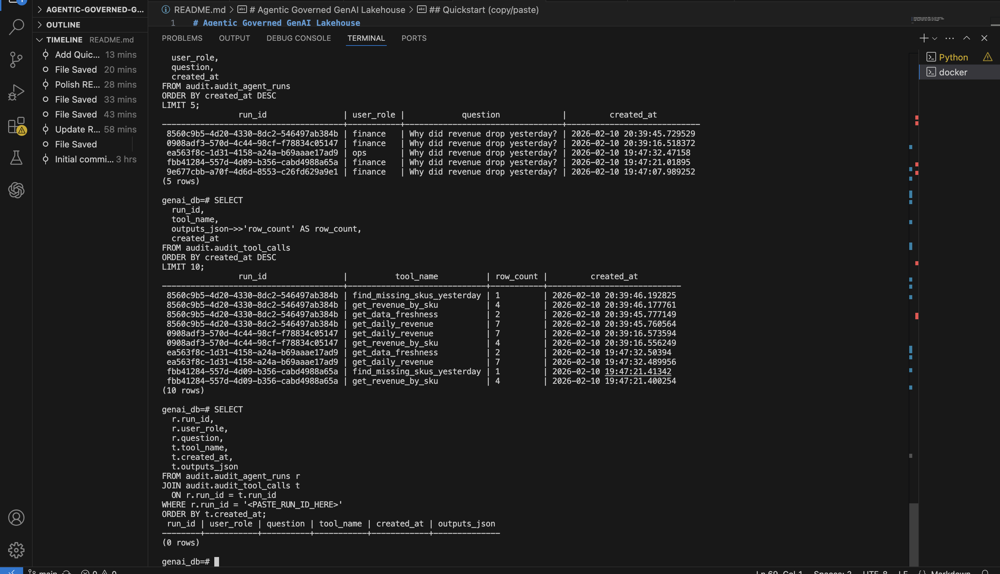

# Agentic Governed GenAI Lakehouse

A production-style **agentic analytics system** that investigates KPI anomalies using **governed SQL tool-use**, **RAG-grounded explanations**, and **role-based access control (RBAC)** — with full auditability and a daily monitoring job.

This is built like an **operational data product**, not a chatbot demo.

---
## Demo

### Agent run




### Audit log



---

## Quickstart (Run locally)

This project can be run locally in under 5 minutes.

### 1) Clone the repository
```bash
git clone https://github.com/datta306/agentic-governed-genai-lakehouse.git
cd agentic-governed-genai-lakehouse

## What you can ask

> **"Why did revenue drop yesterday?"**

The agent:
1. Detects the anomaly from KPI tables
2. Checks data freshness
3. Investigates missing SKUs (if role permits)
4. Grounds the explanation using internal documentation (RAG)
5. Logs every tool call with full run lineage

---

## Key features

- **Agentic tool orchestration**
  - SQL tools and RAG retrieval are called in an intentional, explainable order
  - No hallucinated answers — every claim is backed by data or docs

- **Governance & security**
  - `finance` role → allowed SKU-level revenue details
  - `ops` role → restricted to aggregate KPIs only
  - Access enforced at the **tool layer**, not via prompts

- **RAG (Retrieval-Augmented Generation)**
  - Vector search over internal markdown documentation
  - Metric definitions, known issues, and security policies used for grounding

- **Audit & lineage**
  - Every agent run logged
  - Every tool call logged (timestamp, role, row counts, outputs)
  - Full traceability via Postgres audit tables

- **Daily monitoring pipeline**
  - Threshold-based anomaly detection
  - Alert events recorded for downstream workflows

---

## Architecture (high level)

- **PostgreSQL**
  - Gold KPI tables
  - `audit` schema for agent runs & tool calls
  - Optional alerts schema

- **Qdrant**
  - Vector database for RAG document retrieval

- **Python**
  - `agents/` → planner agent (reasoning + execution)
  - `tools/` → governed SQL tools + RAG retriever
  - `pipelines/` → daily monitoring job
  - `governance/` → RBAC enforcement + lineage logger

---

## Prerequisites

- Docker Desktop installed and running
- Python **3.10+** (3.11 recommended)
- Docker Compose v2  
  > Use **`docker compose`** (not `docker-compose`)

---

## Quickstart (copy / paste)

```bash
# 1) Start infrastructure (Postgres + Qdrant)
docker compose up -d

# 2) Create virtual environment and install dependencies
python -m venv .venv
source .venv/bin/activate
pip install -r requirements.txt

# 3) Embed internal docs into Qdrant (RAG)
python rag/embedding_pipeline.py

# 4) Validate RBAC enforcement
python test_permissions.py

# 5) Run the agent
python agents/planner_agent.py \
  --role finance \
  --question "Why did revenue drop yesterday?"
